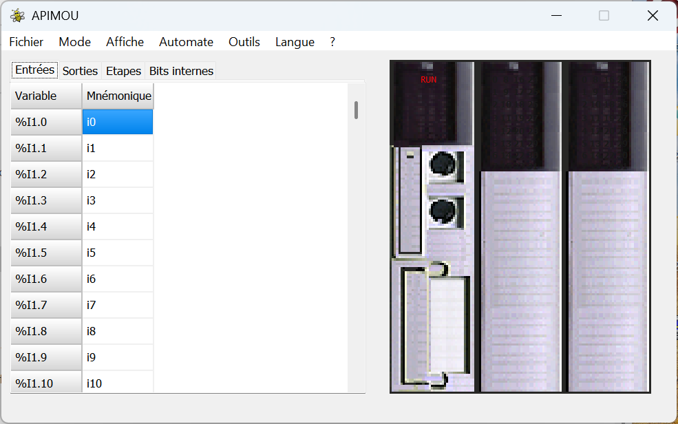

# Apimou - Simulateur d'automates programmables / Programmable Logic Controller Simulator

🔖 Apimou is free software (not open source). See [LICENSE](LICENSE) for details.

## 🇫🇷 Présentation

**Apimou** est un simulateur d'automate programmable industriel (API) destiné à l'apprentissage de la logique combinatoire et séquentielle.

### Fonctionnalités principales

- 32 entrées et 32 sorties binaires
- Bits internes : étapes, temporisations, compteurs, mémoires
- Programmation en équations logiques ou en GRAFCETs
- Éditeur de GRAFCETs complet : séquences, sélections, parallélismes, multi-grafcets
- Simulation autonome ou connectée à des parties opératives (virtuelles ou réelles)
- Parties opératives logicielles incluses : feux de signalisation, ascenseur, chariots, etc.
- Extension Dido : communication avec modules externes via Modbus
- Génération automatique de code Arduino/ESP32 pour visualisation Wi-Fi en temps réel

### Téléchargements

- ✅ [Version Windows (exécutable .zip)](https://github.com/apimou/logiciel-Apimou/releases)
- 💾 [Sources du projet C++Builder (.zip)](https://github.com/apimou/logiciel-Apimou/releases)

### Contact

François Arnaud – [apimou@laposte.net](mailto:apimou@laposte.net)  
Page officielle : [https://sites.google.com/view/apimou/](https://sites.google.com/view/apimou/)

---

## 🇬🇧 Overview

**Apimou** is a PLC simulator designed for learning and simulating combinational and sequential logic.

### Main Features

- 32 binary inputs and 32 outputs
- Internal bits: steps, timers, counters, memory
- Programming via logic equations or GRAFCET charts
- Full GRAFCET editor: sequences, selections, parallelism, multi-GRAFCET
- Autonomous simulation or real-time interaction with virtual/real devices
- Built-in virtual devices: traffic lights, elevator, conveyor systems, etc.
- Dido extension for Modbus-based hardware interaction
- Automatic Arduino/ESP32 code generation with live web visualization

### Downloads

- ✅ [Windows version (executable .zip)](https://github.com/apimou/logiciel-Apimou/releases)
- 💾 [Source code C++Builder (.zip)](https://github.com/apimou/logiciel-Apimou/releases)

### Contact

François Arnaud – [apimou@laposte.net](mailto:apimou@laposte.net)  
Official page: [https://sites.google.com/view/apimou/](https://sites.google.com/view/apimou/)

---

Merci d’utiliser Apimou ! / Thank you for using Apimou!